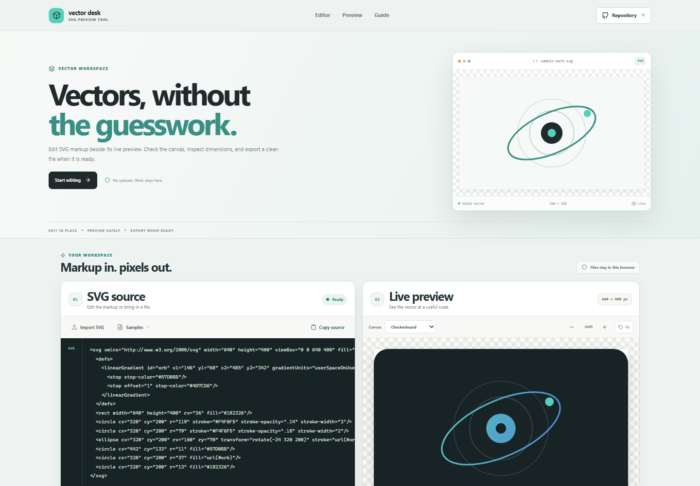



# SVG Preview Tool

A browser-based SVG editor and preview workspace. Edit or import vector markup, inspect the rendered artwork on different canvases, review its dimensions, and export SVG or PNG files without sending content to a server.

**Live app:** [https://a2rp.github.io/svg-preview-tool/](https://a2rp.github.io/svg-preview-tool/)

## What is included

- A source editor with a built-in example, three selectable SVG samples, and copy-to-clipboard support.
- Local file import through the file picker or drag and drop.
- A live preview that checks XML before rendering and shows a useful message for malformed input.
- Checkerboard, white, and graphite preview canvases, plus zoom controls from 25% to 200% and a Fit control that returns to 100%.
- Intrinsic dimensions and `viewBox` inspection. SVG lengths in px, in, cm, mm, pt, and pc are converted to CSS pixels. A valid `viewBox` supplies missing or unsupported dimensions, and markup without either falls back to 512 by 512 pixels.
- A preview-safe SVG download and a transparent PNG export rendered at up to 2x scale.
- A responsive layout with section navigation, a repository link, a usage guide, a shared footer, and a scroll-aware Back to top button.

## Use the editor

Edit the markup directly, or choose **Import SVG** and select a local `.svg` file. You can also drop one onto the editor. Choose **Samples** to view the built-in examples. Importing a file or switching to a sample opens a confirmation dialog because that action replaces the current text. Cancel, Escape, or clicking outside the dialog keeps the editor content unchanged.

The preview updates shortly after each edit. The background selector changes only the preview canvas. Zoom controls change the display size without changing the SVG. **Copy source** copies the original editor text. **SVG** downloads the cleaned markup used by the preview. **Export PNG** renders the cleaned preview to a transparent PNG file.

## Safety and limits

SVG markup and local files stay in the current browser tab. Nothing is uploaded or stored between sessions. Refreshing the page restores the starting example.

Input is limited to 1 MB. Invalid XML, documents with a non-SVG root, and document type or entity declarations are rejected for preview. Before rendering, the tool removes scripts, embedded HTML, frames, objects, media elements, event-handler attributes, and external references. Local fragment references such as `url(#shape)` remain available. The editor keeps the text you entered, while preview and SVG download use the cleaned markup.

PNG output is limited to 16 million pixels and an 8192-pixel maximum side. Large source dimensions are reduced to stay under those limits. The PNG canvas remains transparent, independent of the preview background color.

## Run locally

Use Node.js 20.19+ or 22.12+ and npm.

```sh
npm install
npm run dev
```

Run the test suite, ESLint, and production build with:

```sh
npm test
npm run lint
npm run build
```

Deploy the production build to GitHub Pages with:

```sh
npm run deploy
```

The deploy script builds first and publishes the contents of `dist` to the `gh-pages` branch. Vite is configured for the project URL: [https://a2rp.github.io/svg-preview-tool/](https://a2rp.github.io/svg-preview-tool/).

## Future improvements

These are ideas and are not implemented yet:

- Add optional PNG background and scale settings before export.
- Add SVG path and group selection with editable attributes.
- Add a side-by-side view for comparing two versions of an SVG.

## Links

- Portfolio: [https://www.ashishranjan.net](https://www.ashishranjan.net)
- GitHub: [https://github.com/a2rp](https://github.com/a2rp)
- CodePen: [https://codepen.io/ash1198](https://codepen.io/ash1198)
- LinkedIn: [https://www.linkedin.com/in/aashishranjan](https://www.linkedin.com/in/aashishranjan)
- Facebook: [https://www.facebook.com/theash.ashish/](https://www.facebook.com/theash.ashish/)
- YouTube: [https://www.youtube.com/@ashishranjan-ashz?sub_confirmation=1](https://www.youtube.com/@ashishranjan-ashz?sub_confirmation=1)
- Email: [mailto:ash.ranjan09@gmail.com](mailto:ash.ranjan09@gmail.com)

## Support

- Support: [https://a2rp-donation-page.netlify.app/](https://a2rp-donation-page.netlify.app/)
- Buy Me a Coffee: [https://buymeacoffee.com/ashishranjan](https://buymeacoffee.com/ashishranjan)
- Patreon: [https://www.patreon.com/ashishranjan](https://www.patreon.com/ashishranjan)
